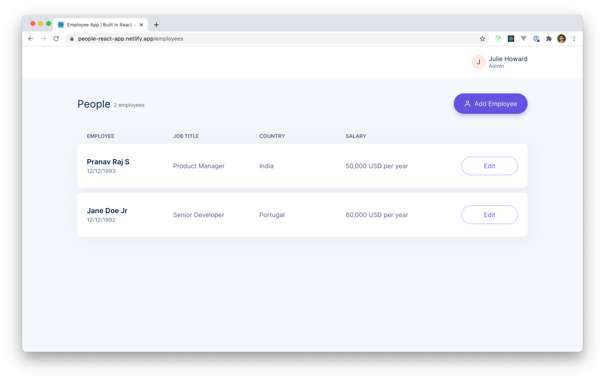

### People React App

[](https://app.netlify.com/sites/people-react-app/deploys)

An employee management app using React and Redux. The application is built using the following packages

- [**React**](https://reactjs.org)
- [**Redux Toolkit**](https://redux-toolkit.js.org) - An opinionated way of writing redux applications
- [**Formik**](https://formik.org)
- [**Jest**](https://jestjs.io) for tests
- [**Storybook**](https://storybook.js.org) for component testing and documentation



### Live demo

Live demo of this application can be viewed at [people-react-app.netlify.app](https://people-react-app.netlify.app)

*Note: Persisent store is not added to the application, if you refresh the page, your data will be lost*

### Setup

You need Node.js (12.x.x or greater) and Yarn package manager installed on your system.

Clone the project and run the following command

```bash
yarn
```

This would install all required packages for the application.

### Development

The following steps will guide you to setup the development environment

### Storybook

Storybook is an open source tool for developing UI components in isolation for React. To build a component, run storybook by using the following command.

```bash
yarn storybook
```

The storybook will be available at http://localhost:6006

### Application development

To run the application, use the following command

```bash
yarn start
```

The application will be available at http://localhost:3000

### Application deployment

To build the application for production, use the following commands

```bash
yarn build
```

The output will be available in the `build` directory.

### Themes

The application supports themeing with CSS Variables. Inorder to change the colors, take a look at 'src/stylesheets/colors.css';

Note: CSS Variables are not supported in IE. If you want the application to work on IE, please add appropriate polyfills.
